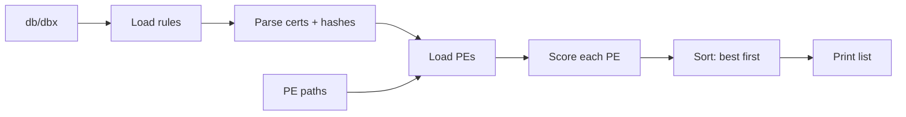
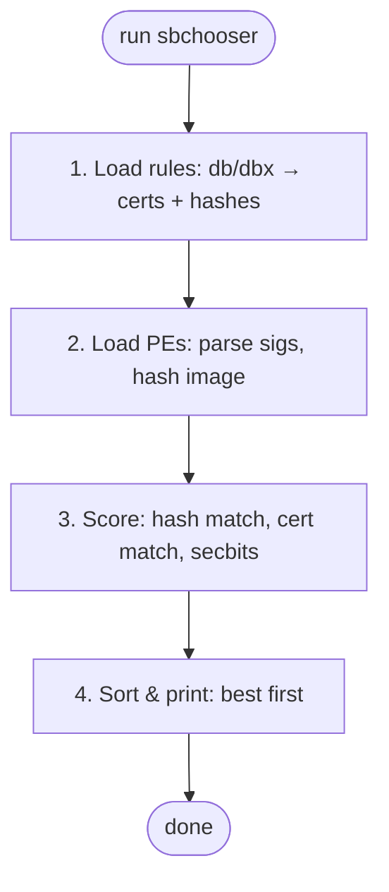
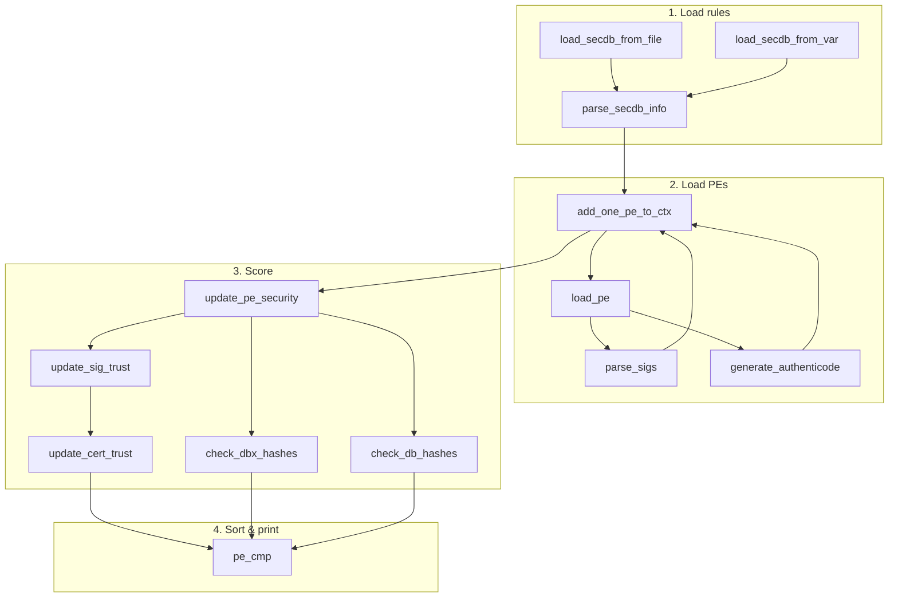
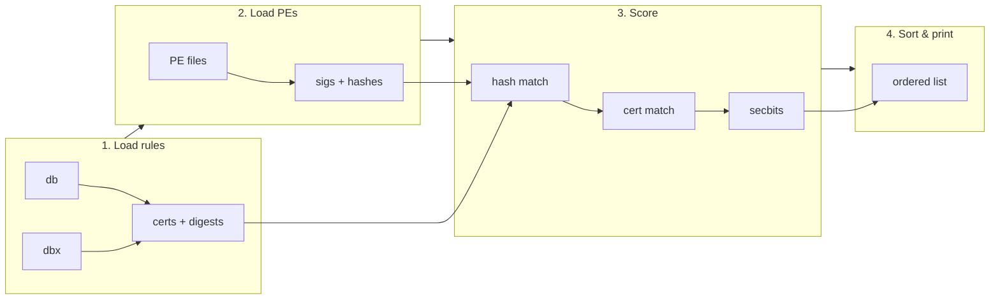
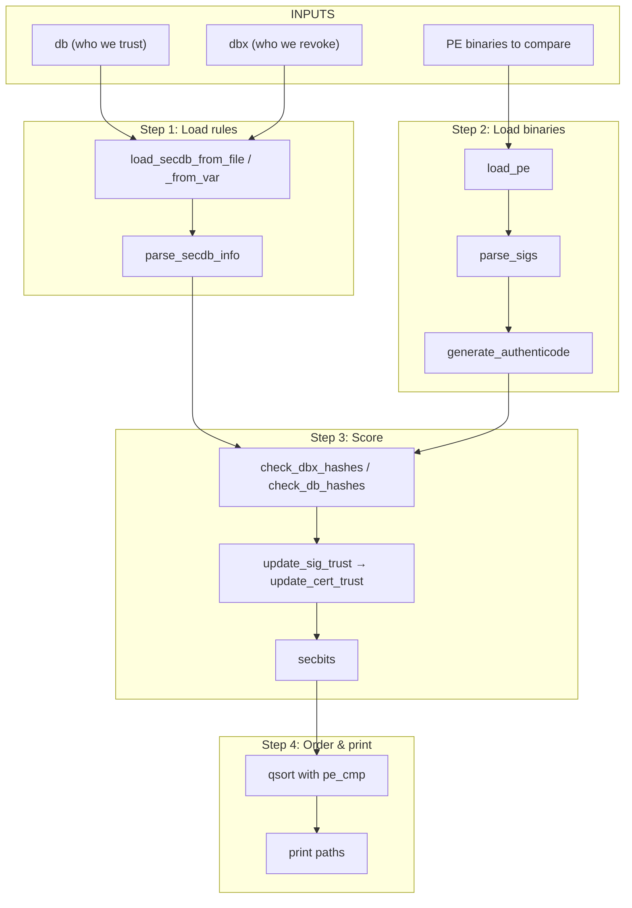

# sbchooser

## Installing sbchooser

Upstream (efivar repo) does not package sbchooser as a separate install target; it is built and installed with the rest of the tree:

```bash
# From the efivar repo (sbchooser branch)
make
make install
```

Optional: `make install PREFIX=/usr` or `make install DESTDIR=/tmp/stage` for a custom prefix or staged install. The binary is installed to `$(BINDIR)` (default `$(EXEC_PREFIX)/bin`).

**Trace instrumentation:** Build with the tree that includes the trace hooks, then run with `--trace` to print every instrumented function enter/exit and key parameters to stderr (e.g. `sbchooser --trace -s -S /path/to/shim1.efi /path/to/shim2.efi 2>trace.log`). Instrumented: `main`, `add_one_pe_to_ctx`, `add_file_to_ctx`, `load_secdb_from_file`, `load_secdb_from_var`, `parse_secdb_info`, `parse_one_secdb_cert`, `add_cert`, `add_digest`, `load_pe`, `update_pe_security`, `pe_cmp`, `generate_authenticode`, `elaborate_x509_info`, and their return paths.

---

## How upstream finds things (6 steps)

**Step 1: Load PE**  
Read PE paths from CLI or stdin. For each path: open file, mmap it, validate DOS/PE headers and security directory.

**Step 2: Parse PE**  
For each loaded PE: walk the security directory, parse each PKCS#7 signature and cert chain; compute Authenticode image hashes (SHA256, SHA384, SHA512).

**Step 3: Parse DB**  
Load db and dbx from file (`-d`/`-x`) or EFI vars. Walk each store and build in-memory lists of certs and hashes (SHA1/SHA256/SHA384/SHA512).

**Step 4: Declare PE as trusted**  
For each PE: compare its image hashes to dbx then db (revoked/trusted by hash); compare each signature’s certs to dbx then db (revoked/trusted by cert); set secbits from weakest trusted cert in the chain.

**Step 5: Order multiple PEs**  
Sort all PEs with `pe_cmp`: prefer non-revoked, then hash-trusted, then higher secbits, then cert validity, then filename.

**Step 6: Print winner and sorted list**  
Walk the sorted list; for each PE print path (and with `--explain`, the trust/revocation rationale). Revoked or untrusted PEs are skipped in the list.

---

## Testing sbchooser with props (launch-with-uefi)

Props at `/Users/simsingh/cursor/props` provides `launch-with-uefi` to start VMs with a given UEFI preset (db/dbx baked into the image). Presets: **ms-2011-only**, **ms-2023-only**, **ms-both** (2011+2023).

Example (AWS): `./main.sh cloud aws --user <u> -d rhel --release 9 launch-with-uefi [--preset ms-2011-only|ms-2023-only|ms-both] [--script-nightly-repo-setup]`. Use `--script-nightly-repo-setup` so nightly repos are configured after launch (needed to install shim from devel/nightly).

**Suggested test matrix**

| Instance preset | Run sbchooser with | Check |
|-----------------|--------------------|--------|
| 2011 (ms-2011-only) | Newer shim | Newer trusted or not (e.g. 2023-only signed) |
| 2023 (ms-2023-only) | Older shim | Older trusted or revoked (e.g. in 2023 dbx) |
| 2011+2023 (ms-both) | Older shim, newer shim, or both / dual-signed | Order printed (best first); both trusted when applicable |

**After launch:** SSH into the VM. You need (1) **nightly repos** so you can install shim (and any devel builds): use **`--script-nightly-repo-setup`** when launching so the post-launch script configures dnf to use Red Hat nightly/devel repos (and SSH with the tunnel it prints, e.g. `-R 8080:squid.corp.redhat.com:3128`, for dnf to reach them). (2) **sbchooser** is not in default RHEL repos: build from efivar source on the VM (e.g. clone the sbchooser branch, `make`) or install from a repo that packages it. Then install the shim(s) you need (e.g. from the nightly repos) and run sbchooser manually with paths to those PEs (and `-d`/`-x` or system db/dbx as needed).

---

## Feature comparison (sbchooser-dev vs upstream)

| Feature | sbchooser-dev (ours) | Upstream (efivar sbchooser) |
|--------|----------------------|-----------------------------|
| **db source** | `-d` file only; fallback EFI var | `-d` file; `-s` system db; `-D` no system db |
| **dbx source** | `-x` file only; fallback EFI var | `-x` file; `-S` system dbx; `-X` no system dbx |
| **Input** | CLI args only (PE paths) | CLI args; `-i`; stdin (list of paths) |
| **Trust by image hash** | No | Yes (SHA256/SHA384/SHA512 vs db/dbx) |
| **Trust by cert** | Yes (cert SHA1 in db/dbx) | Yes (cert in db/dbx, issuer/same cert) |
| **Scoring** | Weighted: algo + keysize + expiry + vendor (0–100 each) | secbits = min(md_secbits, pk_secbits) |
| **Output** | One “Best: &lt;file&gt;” + per-file verdict | Sorted list of all trusted PEs (best first) |
| **--explain** | No | Yes (prints rationale per PE) |
| **--first-sig-only** | No | Yes |
| **--verbose / -v** | Yes | Yes |
| **--debug / -D** | Yes (dev); -D = debug | No (-D = no-system-db) |
| **PE parsing** | load_pe, pe_get_pkcs7, pkcs7_find_certs/next_cert | load_pe, parse_sigs, add_one_sig, parse_pkcs7, generate_authenticode |
| **secdb use** | Iterate ESLs, match cert SHA1 | parse_secdb_info → add_cert/add_digest (certs + hashes) |
| **Extra modules** | sbchooser-sha1, sbchooser-sig, sbchooser-score | sbchooser-x509, authenticode (image hash) |

---

## Upstream flow summary (functions)

| # | Function(s) | File | What it does | Why needed |
|---|-------------|------|--------------|------------|
| 1 | `main` | sbchooser.c | Parses options (-d/-x db/dbx, -i inputs, -f first-sig-only, --explain), creates `efi_secdb_t` for db/dbx, then loads inputs. | Entry point; wires db/dbx sources and PE inputs before any trust evaluation. |
| 2 | `load_secdb_from_file`, `load_secdb_from_var` | sbchooser-db.c | Loads UEFI security database (db or dbx) from a file or from EFI variable; calls `efi_secdb_parse`. | Supplies trusted (db) and revoked (dbx) certs/hashes for later PE trust checks. |
| 3 | `parse_secdb_info` → `parse_one_secdb_cert` → `add_cert` / `add_digest` | sbchooser-db.c | Visits db then dbx via `efi_secdb_visit_entries`; for each entry adds X509 cert (add_cert + `elaborate_x509_info`) or digest to ctx. | Builds in-memory lists of db/dbx certs and hashes so PEs can be checked against them. |
| 4 | `add_one_pe_to_ctx` → `load_pe` → `add_file_to_ctx` | sbchooser.c, sbchooser-pe.c | For each input path: loads PE (map, validate headers, set sec_dir), then appends to ctx->files. | Collects all candidate PE binaries and validates basic PE structure before scoring. |
| 5 | `load_pe` → `parse_sigs` → `add_one_sig` → `parse_pkcs7` → `add_one_cert` | sbchooser-pe.c | Parses PE security directory; for each WIN_CERT_TYPE_PKCS_SIGNED_DATA parses PKCS#7, extracts signer certs, calls `elaborate_x509_info` and `cert_sec_cmp` for “worst” cert. | Extracts Authenticode signatures and cert chains so each PE can be matched to db/dbx certs and given a strength (secbits). |
| 6 | `generate_authenticode` → `generate_authenticode_begin` / `generate_authenticode_digest` / `generate_authenticode_final` | authenticode.c | Computes SHA256, SHA384, SHA512 image hashes over PE (headers + sections, excluding cert table) and stores in pe_file_t. | Produces image hashes so PEs can be matched to db/dbx hash entries (trust/revocation by hash). |
| 7 | `update_pe_security` → `check_dbx_hashes`, `check_db_hashes` → `check_secdb_hash` | sbchooser-pe.c | Compares pe’s sha256/sha384/sha512 to ctx dbx digests (sets *_revoked) and db digests (sets *_trusted). | Marks PE as revoked/trusted by hash per UEFI Secure Boot (dbx wins over db). |
| 8 | `update_pe_security` → `update_sig_trust` → `update_cert_trust` → `get_revocation`, `get_authorization` | sbchooser-pe.c | For each sig cert: checks dbx (get_revocation via `is_same_cert`/`is_issuing_cert`), then db (get_authorization); sets cert/sig trusted/revoked and rationale. | Decides if each signature is trusted or revoked by cert (not just hash) so secbits and output order are correct. |
| 9 | `update_pe_security` (secbits aggregation) | sbchooser-pe.c | After all sigs: takes minimum of lowest_md_secbits and lowest_pk_secbits across trusted sigs; sets pe->secbits and pe->rationale. | Single “strength” value per PE for sorting; respects --first-sig-only by breaking after first sig when set. |
| 10 | `pe_cmp` → `get_highest_hash_secbits`, `compare_validities` | sbchooser-pe.c | qsort comparator: prefer non-revoked, then hash-trusted over not, then higher hash secbits, then higher pe->secbits, then later expiry / earlier not_before, else strcmp filename. | Orders PEs so the “best” secure-boot choice is first; main loop prints in this order and uses `is_revoked_by_hash`/`is_trusted_by_hash` for --explain and filtering. |

**Function count (invocation → printed sorted list):** 40 distinct functions. Line counts (in the path to printed sorted list):

| File | # | Function | Lines |
|------|---|----------|-------|
| sbchooser.c | 3 | main | 270 |
| sbchooser.c | | add_one_pe_to_ctx | 19 |
| sbchooser.c | | add_file_to_ctx | 18 |
| sbchooser-db.c | 6 | load_secdb_from_file | 32 |
| sbchooser-db.c | | load_secdb_from_var | 28 |
| sbchooser-db.c | | parse_secdb_info | 26 |
| sbchooser-db.c | | parse_one_secdb_cert | 45 |
| sbchooser-db.c | | add_cert | 56 |
| sbchooser-db.c | | add_digest | 42 |
| sbchooser-pe.c | 19 | load_pe | 314 |
| sbchooser-pe.c | | parse_sigs | 51 |
| sbchooser-pe.c | | add_one_sig | 71 |
| sbchooser-pe.c | | parse_pkcs7 | 30 |
| sbchooser-pe.c | | add_one_cert | 55 |
| sbchooser-pe.c | | image_is_64_bit | 10 |
| sbchooser-pe.c | | get_section_vma | 57 |
| sbchooser-pe.c | | update_pe_security | 64 |
| sbchooser-pe.c | | check_dbx_hashes | 13 |
| sbchooser-pe.c | | check_db_hashes | 13 |
| sbchooser-pe.c | | check_secdb_hash | 25 |
| sbchooser-pe.c | | update_sig_trust | 26 |
| sbchooser-pe.c | | update_cert_trust | 50 |
| sbchooser-pe.c | | get_revocation | 32 |
| sbchooser-pe.c | | get_authorization | 32 |
| sbchooser-pe.c | | pe_cmp | 47 |
| sbchooser-pe.c | | get_highest_hash_secbits | 16 |
| sbchooser-pe.c | | compare_validities | 67 |
| sbchooser-pe.c | | is_revoked_by_hash | 24 |
| sbchooser-pe.c | | is_trusted_by_hash | 24 |
| sbchooser-x509.c | 6 | elaborate_x509_info | 120 |
| sbchooser-x509.c | | is_same_cert | 29 |
| sbchooser-x509.c | | is_issuing_cert | 19 |
| sbchooser-x509.c | | cert_sec_cmp | 9 |
| sbchooser-x509.c | | time_cmp | 28 |
| sbchooser-x509.c | | fmt_time | 20 |
| authenticode.c | 6 | generate_authenticode | 96 |
| authenticode.c | | generate_authenticode_begin | 57 |
| authenticode.c | | generate_authenticode_digest | 148 |
| authenticode.c | | generate_authenticode_final | 13 |
| authenticode.c | | update_all_hashes | 13 |
| authenticode.c | | fmt_digest | 44 |

(Cleanup and error-only paths excluded.)

---

## ASCII overview

```
    ┌─────────────┐     ┌─────────────┐
    │  db / dbx   │     │  PE paths   │
    └──────┬──────┘     └──────┬──────┘
           │                   │
           ▼                   │
    ┌─────────────┐            │
    │ 1. Load     │            │
    │    rules    │            │
    └──────┬──────┘            │
           ▼                   ▼
    ┌─────────────┐     ┌─────────────┐
    │ 2. Load PEs │     │ (sigs+hash) │
    └──────┬──────┘     └──────┬──────┘
           └─────────┬─────────┘
                     ▼
              ┌─────────────┐
              │ 3. Score    │
              │ (db/dbx)    │
              └──────┬──────┘
                     ▼
              ┌─────────────┐
              │ 4. Sort &   │
              │    print    │
              └─────────────┘
```

## Big picture



## Block diagram



## Function flow



## Data flow



## One-page overview


